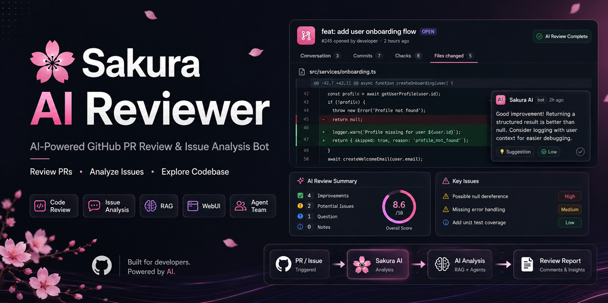
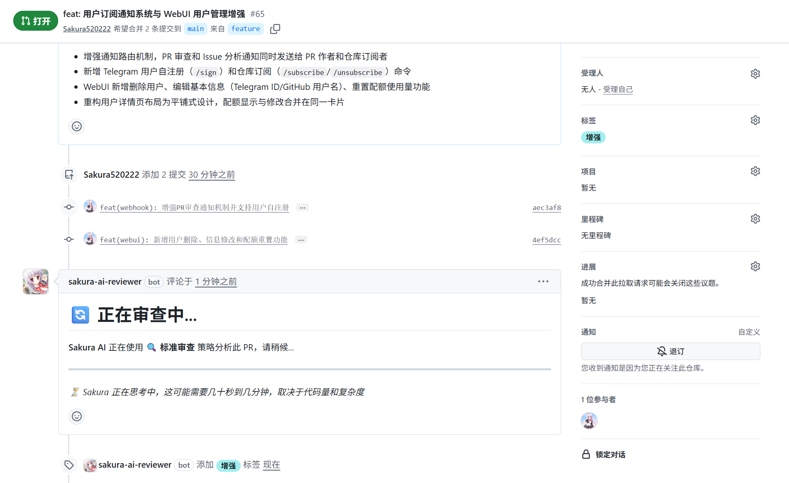
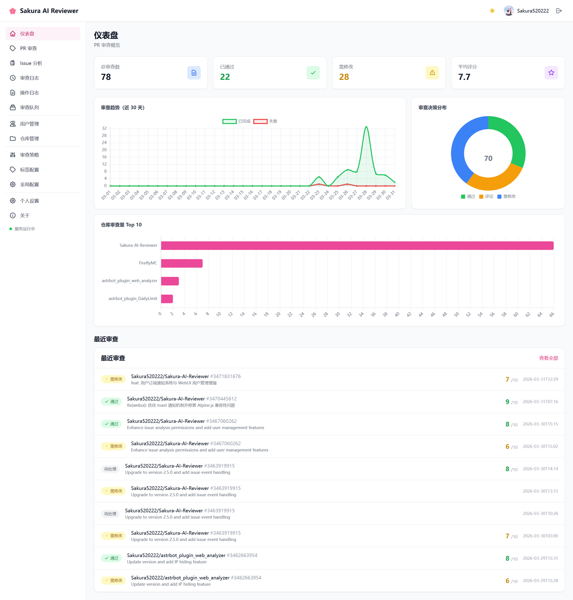

<div align="center">

# 🌸 Sakura AI



> AI-powered intelligent GitHub Pull Request code review and Issue analysis bot with proactive codebase exploration capabilities

**English** | [中文](README.md)

[](https://github.com/Sakura520222/Sakura-AI/releases)
[](https://www.python.org/)
[](https://fastapi.tiangolo.com/)
[](LICENSE)
[](https://ai.firefly520.top/)
[](https://github.com/Sakura520222/Sakura-AI-APP)

</div>

---

## Official Service

**Official Service Platform**: [https://ai.firefly520.top/](https://ai.firefly520.top/)

- **Free Quota**: Register to receive free trial credits for PR review, Issue analysis, and other core features
- **Full Features**: Experience all features including PR review, Issue analysis, Agent task delegation, Repository Aid, and more
- **No Deployment Required**: Ready to use out of the box — no need to set up servers or configure environments

> If you want to self-host or contribute to development, refer to the [Quick Start](#quick-start) section below.

---

## Core Features

### Review Capabilities

- **AI Reasoning Mode**: Leverages AI reasoning for in-depth code analysis, proactively invoking tools to inspect project structure and arbitrary files
- **Cross-file Dependency Understanding**: Understands complex inter-module dependencies through multi-turn dialogue with a "global view"
- **Adaptive Review Strategy**: Automatically selects quick / standard / deep review mode based on PR size
- **Large PR Compact Review**: Automatically switches to compact diff mode when the initial diff approaches the context threshold; AI inspects changes on demand through `get_file_diff` / `list_changed_files`
- **Structured Review Reports**: Overall score + categorized issues (Critical / Important / Suggestion) + `<details>` collapsible sections
- **Incremental Review Continuation**: Incremental PR reviews restore the previous reviewer ActivitySession message history instead of relying on summary-based history injection
- **In-flight Increment Queue**: New `synchronize` commits received during an active review are queued instead of launching a parallel review; pending changes are merged into one user message before the next AI request
- **On-demand Diff Control**: The incremental queue does not add hardcoded diff truncation; content size remains governed by tool-driven inspection, existing configuration, and context compression
- **Smart Review Approval**: Automatically decides APPROVE / REQUEST_CHANGES / COMMENT based on AI scores
- **Strict Review Output Contract**: Reviewer output is governed by a strict envelope protocol with field validation and severity score caps; invalid responses are auto-repaired or safely degraded to prevent accidental approvals and erroneous low-score rejections
- **PR Change Summary**: AI auto-generates PR change summaries with incremental updates when the PR is updated
- **PR Dependency Graph**: Supports both AI analysis and static import analysis modes to generate Mermaid-format visual dependency graphs; incremental reviews build on the previous graph, preserving historical dependency nodes and edges
- **Token Consumption Tracking**: Real-time tracking of token usage and estimated costs across all AI API calls during review
- **One-click Revoke**: Admins can use `/revoke` to instantly withdraw all AI comments and reviews
- **Auxiliary Model Support**: Independently configure lightweight models for summarization, label recommendation, and other tasks to reduce inference costs
- **Inline Comments Toggle**: Control whether inline comments are posted on PR diffs via WebUI config `enable_inline_comments`, reducing review noise
- **Controlled Auto Review**: Use WebUI config `enable_auto_review` to control whether PR opened/synchronize/reopened events enqueue reviews automatically while keeping command and manual triggers available
- **Check Runs Progress Visualization**: Maps the review lifecycle (queued, fetch changes, code indexing, PR summary, AI review, report generation, completed, failed, cancelled, skipped) to the main `Sakura AI Review` check (5-step progress list + final decision conclusion), and optionally attaches sub-checks `Sakura AI - Analysis` (AI runtime metrics: rounds / tool calls / tokens / context / duration) and `Sakura AI - Findings` (finding severity breakdown + publish status) in tool mode. Only the main check should be configured as a required status check — sub-checks may not always appear (standard mode has no Analysis, no findings yields no Findings), so marking them required would block merges; conclusion uses display-only semantics (only a review error yields failure, never blocking merges)
- **External CI Failure Injection**: Subscribes to `check_run.completed` and `workflow_job.completed`, collects failure conclusions, failed steps, and Checks annotations from other CI systems (such as GitHub Actions, Codecov, and lint Apps), then injects them as untrusted evidence into the next PR review request; collected records are status-filtered, cleaned up automatically, and deduplicated so failures from the same `(source, name)` on the same PR keep the latest record and avoid repeated evidence polluting review context
- **Review Comment Label Interaction**: Review reports include label checkboxes — users can check/uncheck labels directly on the GitHub PR page, and the AI automatically applies or removes corresponding labels
- **AI-generated PR Descriptions**: When agents create PRs, AI auto-generates descriptions with metadata markers, allowing subsequent reviews to precisely identify and update AI-injected areas

### AI Tools & Knowledge Base

- **AI Tool System**: read_file, list_directory, search_in_files, get_git_info, list_commits, search_web, read_sakura_docs, list_sakura_directory, read_sakura_memory — AI proactively invokes tools on demand
- **Cross-file Code Search**: AI can search keywords across files in the repository, quickly locating all usages of functions, variables, and classes
- **Git Information Query**: AI can retrieve repository info, branch lists, and commit history to understand project evolution
- **Web Search Enhancement**: Supports DuckDuckGo / Tavily, allowing AI to actively search the internet to assist review decisions
- **URL Fetching**: AI can fetch specified web pages to expand the external context needed for review
- **Repository-level Knowledge Base (RAG)**: Vector semantic retrieval of project documentation, providing normative context for AI reviews
- **PR Code Auto-indexing**: Syntax-aware chunking + semantic search, enabling AI to precisely locate relevant code
- **Project Memory System**: Self-reflection and knowledge accumulation based on `.sakura/` directory, AI reviews get smarter about your project over time. See [Project Memory Guide](docs/SAKURA_MEMORY_GUIDE.md) (Chinese)

### Repository Scanning

- **AI Full Repository Scan**: Periodic AI-powered code scanning across the entire repository, automatically detecting code quality issues and security vulnerabilities
- **Auto-create Issues**: Automatically creates GitHub Issues for discovered problems, with detailed descriptions and fix suggestions
- **Flexible Scan Configuration**: Configurable scan interval, cooldown time, token budget, concurrency, and more
- **Scan Management UI**: View scan list, scan details, and statistics in WebUI
- **Scan Notifications**: Sends notifications via Telegram Bot when scans complete

### Issue Analysis

- **Intelligent Issue Analysis**: Auto-classification, priority assessment, label recommendation, duplicate detection, linked PR discovery
- **Strict Issue Output Contract**: Issue analysis uses the `<SAKURA_ISSUE_ANALYSIS>` envelope protocol with field validation; invalid responses are repaired once or safely degraded
- **Auto-labeling**: AI categorizes and recommends labels; high-confidence labels are applied automatically
- **Auto-assignment**: AI analyzes issue content and automatically assigns it to appropriate repository collaborators
- **Title Rewriting**: AI automatically improves vague or inaccurate issue titles
- **PR-Issue Linking**: Automatically parses issue references and injects context to enhance review precision
- **Semantic Issue Linking**: Discovers and links related issues based on vector semantic similarity

### Agent Expert Team

- **Super-admin Manual Launch**: Select candidate tasks from Issue analysis and repository scan findings, with natural language filtering, and start automated fix workflows on demand
- **Manual Issue Task Creation**: Paste a GitHub Issue URL or enter `owner/repo#123`; the system validates it and creates an Agent fix task directly
- **Issue Comment Delegation**: Repository admins or write collaborators can comment `/agent` on analyzed Issues or scan report Issues to create fix tasks, optionally adding `base:<branch>` to select the base branch
- **PR Comment One-Click Fix**: Comment `/agent` on a PR review to create an Agent fix task based on that PR's review findings, automatically creating a new fix branch and submitting a fix PR; only one `/agent` task per source PR (supports multi-round iteration)
- **Multi-branch Parallel Workspaces**: Each Agent task uses an isolated Git worktree, supporting multiple concurrent tasks in the same repository without interference
- **Non-admin Repository Access Control**: Non-admin users may only operate repositories they own and that match `agent_team_repo_allowlist`; task creation, retry, and `/agent` delegation consume dedicated Agent quotas
- **Smart Candidate Filtering**: Automatic deduplication, closed-issue filtering, score-based sorting, and AI natural language selection to match the most suitable candidate tasks
- **Two-agent Collaboration**: A full-stack expert plans and edits code, while a professional reviewer performs pre-push quality review
- **Context Compression & Resume**: Long-running tasks compress historical context automatically and persist conversation/message checkpoints for recovery
- **Isolated Git Workspaces**: Uses base checkout + per-task Git worktree isolation under `agent_team_workspace_root`, each task on its own branch, without polluting the service runtime directory
- **Controlled Tool Execution**: File operations, search, and shell validation commands are scoped to the workspace; validation commands are controlled by a blacklist (blocking dangerous commands while allowing the rest)
- **Dependency Auto-install & Validation**: Can detect and install dependencies from `pyproject.toml` / `requirements.txt`, then run allowlisted tests or lint commands
- **Sakura Knowledge Integration**: Agents can browse and read `.sakura/` knowledge directory and reflection files via dedicated tools, leveraging accumulated review experience to assist code fixes
- **Agent Skills & Built-in Ruff**: Install skills from uploaded files, ZIP packages, or GitHub `SKILL.md`; a built-in Ruff lint / format skill can be loaded on demand
- **Real-time Admin Intervention**: Admins can inject guidance through the WebUI Live View during task execution; the Agent consumes and merges guidance into subsequent iteration rounds
- **Task Cancellation**: Supports cancelling Agent tasks mid-execution with safe workspace resource cleanup
- **Web Search & URL Fetching**: Agents can use web search and URL fetching tools to expand their information-gathering capabilities for code fixes
- **Token Usage Tracking**: Real-time tracking of token consumption and estimated costs across all AI API calls in Agent Team
- **Base Branch Selection**: Choose the target branch (develop / main, etc.) when creating tasks for flexible merge direction control
- **Manual Issue Task Preview/Edit**: Preview and edit Issue analysis results in WebUI before creating an Agent task
- **PR Creation Loop**: Supports AI-generated Conventional Commits-style PR titles, descriptions, and commit messages, Draft PR creation, then iterates through Sakura PR Review and human feedback; PRs are never merged automatically
  - Supports two task sources: Issue analysis / scan reports (`/agent` Issue comment) and PR review findings (`/agent` PR comment, `source_type=pr_review`)
  - Agent Team initially opens a Draft PR; the draft opened webhook does not start Sakura PR Review
  - When the Draft PR becomes Ready for review, GitHub `ready_for_review` webhook automatically starts Sakura PR Review
  - Because the PR is created by the bot itself, GitHub only receives ordinary comments; the Agent loop uses Sakura internal structured review results
  - Blocking severities such as critical / major, or a score below `agent_team_pr_review_pass_score`, make the Agent continue iterating on the same `sakura-agent/*` branch
  - The first iteration includes an internal Professional Reviewer pass; subsequent closed-loop iterations skip internal review and go directly to external Sakura PR Review, saving tokens and time
  - After the Agent pushes a new commit, GitHub `synchronize` webhook automatically starts the next Sakura PR Review
  - Automatic iterations are capped by `agent_team_max_iterations_per_task`; when the cap is reached or continuation is unsafe, the task moves to `waiting_human`
  - `agent_team_pr_closed_loop_enabled` can disable the closed loop and restore the previous behavior where PR creation marks the task complete

### Repository Aid

- **Mutual Star Plan**: After a participant authorizes, the system stars other members' displayed repositories on their behalf, driving reciprocal traffic between repositories
- **GitHub App User-to-Server Authorization**: Obtains a user-level token through a dedicated OAuth flow; the token is stored only as encrypted ciphertext and never printed in logs or exceptions
- **Displayed Repository Selection**: Members can choose which of their public repositories participate in display, with AI-generated repository summaries (based on a README budget and language preference)
- **Auto-star Scheduling**: A background scheduler performs auto-stars for each member at randomized intervals, governed by per-user / per-repository daily limits and batch size
- **Idempotency & Audit**: star / unstar / skip / fail operations are all written to an idempotent audit log; duplicate requests are safely skipped, and the same `(actor, target, action)` keeps only the final state
- **Manual Star**: Members can manually star a specific repository from the display list, sharing idempotency logic with auto-star
- **Member & Permission Governance**: Supports join / leave / pause states; admins can ban members and disable offending displayed repositories; banned members cannot join or auto-star
- **Security Checks**: The authorization callback rejects cross-user state reuse, the returned GitHub account must match the logged-in user, and expired tokens automatically transition to re-authorization required
- **WebUI Management Page**: Members can view displayed repositories, today's auto-star usage, and authorization status; admins can manage members, repositories, and feature toggles

### Management & Operations

- **Setup Wizard**: Automatically detects configuration status on first launch, guides you through GitHub App, database, AI model, and RAG setup step by step, with resume support
- **System Core Configuration**: Super admins can modify infrastructure settings (database, GitHub App/OAuth, Telegram, app domain, etc.) at runtime via WebUI — no need to re-run Setup Wizard; changes are automatically audit-logged
- **Dynamic Configuration**: Configuration changes via WebUI take effect immediately without service restart
- **AI API Timeout Control**: `ai_api_timeout_seconds` controls per-request timeout, and `ai_api_total_timeout_seconds` controls the total retry-loop duration for one AI call
- **Per-user Config Overrides**: Users can override allowed preference settings in WebUI or API (currently AI output language), with fallback order UserConfig → AppConfig → Settings defaults
- **AI Provider Registry**: Built-in OpenAI, DeepSeek, Qwen, Z.ai, Doubao, SiliconFlow, Gemini, Anthropic-compatible, and custom OpenAI-compatible providers, with automatic model list and context window discovery
- **GitHub App Installation Management**: Automatically handles GitHub App install/uninstall events, syncing repository authorization status
- **Security Center & MFA**: Supports TOTP, recovery codes, Passkeys/WebAuthn, global / per-user MFA enforcement, admin MFA reset, security event audit logs, MFA failure lockout (dynamic threshold and duration), and API Passkey second-factor authentication; mobile OAuth supports allowlisted redirect URIs, and WebAuthn supports multiple allowed origins plus Android App Links
- **SSE Real-time Push**: Multi-process real-time communication based on Redis Pub/Sub, with instant WebUI data updates
- **Quota-based Access Control**: Flexible quota-based access management system with user self-registration support and UTC daily / weekly / monthly auto-reset for PR, Issue, and Agent usage
- **Paid Quota System**: Full CRUD management for plans and redeem codes (create / edit / delete / batch operations), admin manual grants, supports one-time packages and subscription plans, and can grant PR, Issue, and Agent entitlements
- **External Payments & Refunds**: Supports Stripe, Paddle, Alipay, NOWPayments, direct TRON USDT collection, signed payment webhooks, order cancellation / status polling, user refund requests, super-admin review, and refund notifications
- **Legal Pages**: Built-in terms of service, privacy policy, refund policy, and pricing page (`/legal/*`) to provide compliance-ready display alongside the paid quota system
- **Admin Action Audit**: Complete operation logs covering configuration changes, user management, and other critical actions
- **WebUI Dashboard**: Dashboard charts, PR management, user management, configuration management, queue monitoring, action logs, repository scan management, Agent Expert Team, Agent Skills, Sakura Memory, Repository Aid, vector storage & database management, with Markdown content rendering support
- **Batch Issue Indexing**: Supports batch indexing of repository Issues in WebUI with vector cache refresh and AI metadata enrichment for embedding quality
- **Health Check Endpoint**: `/health` endpoint for Docker health checks and deployment verification, with built-in Docker Compose automatic health detection
- **Registration Quota Management**: Dedicated registration quota configuration group for controlling initial quotas granted to new users upon registration
- **Telegram Bot**: Real-time notifications, interactive button menus, three-tier permission system (super admin / admin / user), quota management
- **GitHub OAuth Login**: Integrated with Telegram user system, light/dark theme switching

---

## Technical Architecture

```
┌─────────────────────────────────────────────────────────────┐
│                        GitHub                                │
│                    PR / Issue / OAuth                        │
└──────────┬───────────────────────────────┬──────────────────┘
           │ Webhook                       │ OAuth / API
           ▼                               ▼
┌─────────────────────────────────────────────────────────────┐
│                    FastAPI Web Server                        │
│  ┌──────────────┐  ┌──────────────┐  ┌──────────────┐      │
│  │   Webhook    │  │  PR Analyzer │  │   Comment    │      │
│  │   Handler    │  │  (Strategy)  │  │   Service    │      │
│  │ (PR+Issue)   │  │              │  │  (Publish)   │      │
│  └──────────────┘  └──────────────┘  └──────────────┘      │
│  ┌──────────────────────────────────────────────────────┐   │
│  │    WebUI (Jinja2 + HTMX + Alpine.js) · SSE Push      │   │
│  ├──────────────────────────────────────────────────────┤   │
│  │  Setup Wizard · Dynamic Config · Repository Aid ·    │   │
│  │  Legal Pages · Audit                                 │   │
│  └──────────────────────────────────────────────────────┘   │
└──────────────────────┬──────────────────────────────────────┘
                       │
                       ▼
┌─────────────────────────────────────────────────────────────┐
│                     AI Review Engine                         │
│  ┌────────────┐  ┌────────────┐  ┌────────────┐            │
│  │ read_file  │  │ list_dir   │  │search_files│            │
│  └────────────┘  └────────────┘  └────────────┘            │
│  ┌────────────┐  ┌────────────┐  ┌────────────┐            │
│  │  git_info  │  │  commits   │  │ search_web │            │
│  └────────────┘  └────────────┘  └────────────┘            │
│  ┌────────────┐  ┌────────────┐  ┌────────────┐            │
│  │ RAG Search │  │ Code Index │  │  History   │            │
│  └────────────┘  └────────────┘  └────────────┘            │
│  ┌──────────────────────┐  ┌──────────────────────┐        │
│  │ read_sakura_docs     │  │ list_sakura_directory │        │
│  └──────────────────────┘  └──────────────────────┘        │
│  ┌──────────────────────┐                                   │
│  │ read_sakura_memory   │                                   │
│  └──────────────────────┘                                   │
└──────────────────────┬──────────────────────────────────────┘
                       │
                       ▼
┌─────────────────────────────────────────────────────────────┐
│                     Data Storage Layer                       │
│  ┌──────────────┐  ┌──────────────┐  ┌──────────────┐      │
│  │    MySQL     │  │    Redis     │  │  ChromaDB    │      │
│  │  (Business)  │  │(Queue/PubSub)│  │  (Vectors)   │      │
│  └──────────────┘  └──────────────┘  └──────────────┘      │
└─────────────────────────────────────────────────────────────┘
```

**Tech Stack**: FastAPI (Python 3.14+) · Jinja2 + Tailwind CSS + HTMX + Alpine.js · DeepSeek-R1 / OpenAI-compatible API · MySQL 8.0 + Redis (Queue/PubSub) + ChromaDB · GitHub App (PyGithub) + OAuth · Docker Compose · Optional Celery Worker

### Client Applications

- **Native Android App**: Under development → [Sakura-AI-APP](https://github.com/Sakura520222/Sakura-AI-APP)
  Connects to the Sakura-AI backend via the [API v1 interface](docs/api-v1-reference.md) for mobile management

---

## Quick Start

### 1. Requirements

- Linux server (Ubuntu 20.04+ recommended)
- Docker and Docker Compose
- Public IP and domain name
- GitHub account
- DeepSeek API Key (or other OpenAI-compatible API)

### 2. Clone the Repository

```bash
git clone https://github.com/Sakura520222/Sakura-AI.git
cd Sakura-AI
```

> All configuration (GitHub App, AI models, database, etc.) is done through the Setup Wizard web interface after first launch — no manual config file editing needed.

### 3. Create a GitHub App

1. Go to [GitHub Apps settings](https://github.com/settings/apps) and click **New GitHub App**
2. Fill in the name and Homepage URL
3. **Repository permissions**: Pull requests `Read and write`, Contents `Read and write`, Checks `Read and write`, Actions `Read`, Issues `Read and write` (optional)
4. **Webhook URL**: `https://your-domain.com:8000/api/webhook/github`, enter Webhook secret
5. **Webhook events**: Check Pull requests, Pull request reviews, Check runs, Workflow jobs, Issues (optional), Issue comments (optional)
6. After creation, click **Generate a private key** at the bottom of the App page, download the `.pem` file (paste the full private key content in Setup Wizard)
7. Click **Install App** on the left sidebar, select the repositories to enable review

> WebUI login requires an additional [OAuth App](https://github.com/settings/developers) with callback URL set to `https://your-domain.com/auth/callback`
>
> To enable Repository Aid, enable **Request user authorization (OAuth on behalf of users)** in the GitHub App settings and grant the **Starring** write permission; the Repository Aid callback URL is `https://your-domain.com/star-aid/auth/callback`.

### 4. Prepare the Database

Install and start MySQL and Redis on the host:

```bash
sudo apt update && sudo apt install mysql-server redis-server -y
sudo systemctl start mysql && sudo systemctl start redis
sudo mysql -e "CREATE DATABASE IF NOT EXISTS \`sakura_ai\` CHARACTER SET utf8mb4 COLLATE utf8mb4_unicode_ci;"
sudo mysql -e "CREATE USER IF NOT EXISTS 'root'@'%' IDENTIFIED BY 'your_password';"
sudo mysql -e "GRANT ALL PRIVILEGES ON *.* TO 'root'@'%';"
sudo mysql -e "FLUSH PRIVILEGES;"
```

### 5. Start the Service

```bash
cd docker
docker-compose up -d
```

To enable the optional Celery Worker (for async tasks):

```bash
docker-compose --profile with-worker up -d
```

### 6. Setup Wizard Configuration

After first launch, visit `https://your-domain.com/setup`. The Setup Wizard will guide you through all configuration steps (supports resume from breakpoint):

1. **Database Configuration**: Enter MySQL and Redis connection addresses, with online connection testing
2. **GitHub App Configuration**: Enter App ID, private key, and Webhook Secret; auto-verifies App connection
3. **AI Model & Notifications**: Configure AI API (supports auto-fetching model list) and Telegram Bot Token
4. **Admin & OAuth**: Set up admin account, application domain, and GitHub OAuth credentials

> Setup Wizard includes RAG embedding and reranking model configuration (collapsible), which can be skipped and configured later in WebUI.

### 7. Verify Deployment

```bash
curl http://your-domain.com:8000/health
# {"status":"healthy","service":"sakura-ai"}
```

WebUI: `https://your-domain.com/`

---

## Usage

### PR Review

Create a PR in a repository with the App installed, and the AI will automatically review it and publish a structured report. Review reports use `<details>` collapsible sections to keep comments concise. Available commands in PRs:

- `/full-review` — Clear old comments and trigger a full re-review (PR author or collaborator)
- `/revoke` — One-click revoke all AI comments and reviews (admin only)

### Issue Analysis

- **Auto-analysis**: Triggered automatically on Issue opened/edited/reopened, posting classification, priority, and label suggestions
- **Auto-labeling**: AI recommends labels; high-confidence labels are applied automatically
- **Manual trigger**: Comment `/analyze` in an Issue
- **Agent delegation**: Repository admins or write collaborators can comment `/agent` on analyzed Issues or scan report Issues to hand the work to Agent Expert Team; use `/agent base:develop` to choose the base branch
- **PR /agent One-Click Fix**: Comment `/agent` on a PR review page to create an Agent fix task based on that PR's review findings, automatically creating a new fix branch and submitting a fix PR; only one `/agent` task per source PR (supports multi-round closed-loop iteration)
- **Duplicate detection**: Automatically identifies duplicate Issues and links to existing ones

### Repository Aid

Visit the "Repository Aid" page in the WebUI:

1. Click **Authorize GitHub App** to complete the user-to-server authorization (the system performs starring on your behalf)
2. **Join the plan** and choose which of your public repositories to display
3. The system automatically stars other members' displayed repositories at randomized intervals; you can also star manually from the list
4. Admins can manage member status, displayed repositories, and feature toggles on the same page

> The authorization token is stored as encrypted ciphertext; auto-starring is governed by per-user / per-repository daily limits, skips repositories you own, and safely skips already-starred repositories.

### WebUI Management

Visit `https://your-domain.com/` and log in with your GitHub account (requires prior registration via Telegram Bot). Features include dashboard charts, PR management, user management, dynamic configuration, review queue monitoring, action logs, Security Center, Repository Aid, and personal MFA / Passkey settings. Configuration changes take effect immediately without service restart.

### Telegram Bot

Provides real-time notifications (review started / completed), quota management, permission control (three-tier system), and rich admin commands. See [Telegram Bot Integration Guide](docs/TELEGRAM_SETUP.md) for details.

---

## Configuration

Global configuration follows this priority: **Database app_config (WebUI) > Settings defaults**. Per-user preference configuration follows **UserConfig > app_config > Settings defaults**. YAML config files (`config/strategies.yaml`, `config/labels.yaml`) manage review strategies and label definitions.

> **Dynamic Configuration**: Changes made via the WebUI configuration page take effect immediately without service restart. Supports multiple configuration groups including AI models, auxiliary models, RAG, web search, code indexing, Repository Aid, and more.

- **AI Model**: Select a built-in AI Provider in WebUI configuration (OpenAI, DeepSeek, Qwen, Z.ai, Doubao, SiliconFlow, Gemini, Anthropic-compatible, or custom OpenAI-compatible), set API URL/API Key/model name, and optionally auto-fetch model lists and context window metadata
- **Auxiliary Model**: Set `summary_model`, `summary_api_base`, `summary_api_key` in WebUI configuration for lightweight tasks like summarization and label recommendation; auto-falls back to main model if left empty
- **PR Auto Review**: `enable_auto_review` in WebUI configuration controls whether PR webhook events automatically trigger reviews; command and manual triggers remain available when disabled
- **Check Runs Visualization**: `enable_check_runs` in WebUI configuration controls whether review progress is synced to the GitHub Checks panel (enabled by default; requires the GitHub App to be granted `checks:write` permission); `enable_analysis_check` / `enable_findings_check` control whether the Analysis / Findings sub-checks are created, and `analysis_min_interval_sec` sets the minimum write interval for Analysis snapshots (to avoid burning API quota on high-frequency updates); each check's external_id is formatted `sakura-ai:v1:<review_job_id>:<check_kind>`, and cross-process recovery reads the DB-persisted check_run_id first, falling back to listing by head_sha + name
- **External CI Failure Injection**: `context_enhancement.ci_failure_injection` in `config/strategies.yaml` controls whether external CI failures are injected, how long records are retained, the maximum number of failure records per review, and the maximum annotations per failure; this feature requires the GitHub App to subscribe to `check_run` / `workflow_job` webhooks and have Checks / Actions read permissions
- **AI API Timeout**: `ai_api_timeout_seconds` controls the per-request timeout, and `ai_api_total_timeout_seconds` controls the maximum total duration of one AI call retry loop
- **Security & MFA**: The WebUI Security Center can enforce MFA globally or per user, reset TOTP/recovery codes, delete Passkeys, and record security audit events; users can enable TOTP, generate recovery codes, and register Passkeys/WebAuthn in personal settings; supports MFA failure lockout (`mfa_lockout_threshold` / `mfa_lockout_duration_minutes`), API Passkey second-factor authentication, extra `passkeys_allowed_origins`, and the `mobile_oauth_allowed_redirect_uris` mobile OAuth redirect allowlist
- **Review Strategy**: Edit `config/strategies.yaml`, supports quick / standard / deep / large-PR four strategies
- **File Filtering**: Configure skipped file extensions and paths in `config/strategies.yaml`
- **AI Tools**: `enable_ai_tools` / `max_tool_iterations` in WebUI configuration
- **Label Recommendation**: `config/labels.yaml` for PR label recommendation toggle and confidence; Issue labels at `issue_auto_create_labels` / `issue_confidence_threshold` in global config
- **Review Approval**: `review_policy` in `config/strategies.yaml` for threshold and repository-level overrides
- **PR Change Summary**: `enable_pr_summary` in WebUI configuration
- **PR Dependency Graph**: `enable_pr_dependency_graph` / `pr_dependency_graph_mode` / `pr_dependency_graph_max_nodes` / `pr_dependency_graph_max_files` in WebUI configuration; `ai` mode uses model-based dependency analysis, while `static` mode uses static import parsing to reduce cost
- **Large PR Context Management**: `model_context_window` / `context_safety_threshold` / `enable_context_compression` / `context_compression_threshold` / `context_compression_keep_rounds` in WebUI configuration; when the initial diff is too large, review automatically uses compact diff tool mode
- **Token Cost Tracking**: `review_price_per_1k_prompt` / `review_price_per_1k_completion` in WebUI configuration for tracking review token consumption and costs
- **Payment Gateways**: Enable the paid quota system with `payment_enabled`, then configure `stripe_*`, `paddle_*`, `alipay_*`, `nowpayments_*`, and `tron_*` gateway settings as needed; supports external payment orders, webhook signature verification, refund requests, and super-admin refund approval
- **RAG Knowledge Base**: Configure embedding models (supports BAAI/bge-m3, etc.), reranking models, ChromaDB in WebUI configuration
- **PR Code Index**: Configure code chunking, supported languages, core directories in WebUI configuration
- **Issue Auto-assignment**: `issue_auto_assign` / `issue_assignee_confidence_threshold` in WebUI configuration
- **Issue Concurrency Control**: `max_concurrent_issues` in WebUI configuration — controls the maximum number of simultaneous Issue analysis tasks; excess tasks are queued
- **Issue Title Rewriting**: `issue_auto_rewrite_title` in WebUI configuration
- **Semantic Issue Linking**: `enable_semantic_issue_linking` / `semantic_issue_similarity_threshold` in WebUI configuration
- **Incremental Review History**: `enable_incremental_history_context` in WebUI configuration, AI auto-learns from historical review records
- **Inline Comments Toggle**: `enable_inline_comments` in WebUI configuration, controls whether inline comments are posted on PR diffs (default: enabled)
- **Web Search Tool**: `web_search_provider` in WebUI configuration (`duckduckgo` free or `tavily` premium)
- **Cross-file Search**: `context_enhancement.search_in_files` in `config/strategies.yaml` — configure GitHub Search API priority, context lines, max results, etc.
- **Git Info Tool**: `context_enhancement.git_tools` in `config/strategies.yaml` — configure default branch and commit return counts
- **Project Memory System**: `sakura_memory_enabled` to enable memory system, `sakura_reflection_enabled` to enable post-review reflection, `sakura_consolidation_interval` for consolidation trigger threshold (default 5), `sakura_auto_init` to auto-initialize `.sakura/` directory, `sakura_auto_create_subdirs` to auto-create rules/docs/plans subdirectories, `sakura_knowledge_extraction_enabled` to enable automatic knowledge extraction (extracts rules/docs/plans via three serial LLM calls), `sakura_extraction_provider` to configure extraction AI credentials (main/summary/custom) — all in WebUI configuration. WebUI provides a "Sakura Memory" management page for viewing/editing/deleting memory files and manually triggering consolidation and knowledge extraction. `context_enhancement.sakura_memory.reflection` in `config/strategies.yaml` configures the max comments (`max_comments`), changed files (`max_changed_files`), and new commits (`max_new_commits`) included in the reflection prompt (defaults 30/30/20); comment text and PR description are passed in full without truncation. See [Project Memory Guide](docs/SAKURA_MEMORY_GUIDE.md) (Chinese)
- **Model Context**: Configure context window, auto-compression in WebUI configuration, see [Model Context Management](docs/MODEL_CONTEXT_FEATURE.md)
- **Agent Expert Team**: Configure `agent_team_enabled`, `agent_team_workspace_root`, `agent_team_repo_allowlist`, `agent_team_model_provider`, and other `agent_team_*` model/guardrail settings on the WebUI Agent Team page; supports context compression (`agent_team_enable_context_compression`, etc.), full-stack/reviewer tool-round limits (`agent_team_max_tool_rounds` / `agent_team_reviewer_max_tool_rounds`), dependency auto-install (`agent_team_auto_install_deps`), validation command blacklists, the Draft PR switch, and the PR review closed loop (`agent_team_pr_closed_loop_enabled`, `agent_team_max_iterations_per_task`, `agent_team_pr_review_pass_score`); `agent_team_model_provider=main` reuses the main AI configuration, while independent Agent AI configuration is also supported; non-admin entry points validate repository ownership and `agent_team_repo_allowlist`, consume Agent quotas, and `/agent` comments can create tasks from analyzed Issues or scan report Issues; supports web search tools and token usage tracking
- **Agent Skills**: Install and toggle Skills on the WebUI Agent Skills page; `agent_team_skills_enabled` controls whether agents may load skills, and `agent_team_skills_root` configures the local storage root
- **Repository Aid**: `star_aid_enabled` is the global toggle in WebUI configuration (the page becomes read-only when disabled); `star_aid_auto_star_enabled` controls whether auto-starring runs (only manual star and display remain when disabled); `star_aid_scheduler_enabled` controls the background scheduler; `star_aid_min_interval_minutes` / `star_aid_max_interval_minutes` set the randomized interval range between two auto-stars for a single member; `star_aid_batch_size` caps how many members are processed per scheduling round; `star_aid_user_daily_limit` / `star_aid_repo_daily_limit` are the per-user / per-repository daily caps; `star_aid_summary_enabled` / `star_aid_summary_language` / `star_aid_summary_readme_budget` / `star_aid_summary_max_tokens` control AI summaries for displayed repositories; `star_aid_github_app_client_id` / `star_aid_github_app_client_secret` / `star_aid_github_app_callback_url` configure the Repository Aid GitHub App user-to-server credentials (you may reuse the review App), and `star_aid_token_encryption_key` sets the token encryption key
- **Internationalization (i18n)**: WebUI supports Chinese/English interface switching (Settings page). AI output language can be controlled globally via `OUTPUT_LANGUAGE` or overridden per user through `output_language` (`zh-CN` / `en` / follow global). Comment templates automatically match the selected language.

---

## Screenshots

<div align="center">







</div>

---

## Development Guide

### Local Development

```bash
pip install -r requirements.txt
python -m backend.main
```

> First launch will enter Bootstrap mode. Visit `http://localhost:8000/setup` to complete configuration via Setup Wizard.

To debug the first-run deployment / Setup Wizard flow locally, start with an isolated dev config:

```bash
py scripts/dev_bootstrap.py
```

The script uses `.sakura/dev/connection.json`, so it will not overwrite the production `config/connection.json`, and it skips Telegram, SSE, scan, and quota background tasks. To restart from step 0:

```bash
py scripts/dev_bootstrap.py --reset
```

### Code Linting

```bash
python run_ruff.py          # check + fix + format
python run_ruff.py --check  # read-only check, no modifications
```

### Tests

```bash
pytest -q
```

### Project Structure

```
Sakura-AI/
├── backend/
│   ├── api/               # API routes (webhook, health, v1)
│   │   └── v1/            #   RESTful API v1 (mobile integration, including user_config/billing/scans)
│   ├── core/              # Core config, dynamic configuration, Setup Wizard, AI provider registry, Redis
│   ├── models/            # Data models (async SQLAlchemy)
│   ├── services/          # Business logic
│   │   ├── agent_team/    # Agent Expert Team, controlled workspace tools, PR creation, and Skills
│   │   │   └── tools/     #   Agent tools (read/write/edit/grep/glob/shell/web/sakura/skill ...)
│   │   ├── ai_reviewer/   # AI review engine
│   │   │   ├── tools/     #   AI tools (file reading, cross-file search, git info, web search, diff, sakura memory)
│   │   │   └── compression/ # Context compression
│   │   ├── payment/        # Payment gateways (Stripe / Paddle / Alipay / NOWPayments / TRON)
│   │   ├── pr_analyzer.py        # PR analyzer (strategy selection)
│   │   ├── issue_analyzer.py     # Issue analysis engine
│   │   ├── issue_service.py      # Issue service (labeling, assignment, rewriting)
│   │   ├── issue_embedding_service.py  # Issue vector embedding
│   │   ├── pr_issue_linker.py    # PR-Issue linking
│   │   ├── decision_engine.py    # Review decision engine
│   │   ├── comment_service.py    # Comment service
│   │   ├── check_run_service.py  # GitHub Check Runs visualization
│   │   ├── ci_failure_service.py # External CI failure injection
│   │   ├── rag_service.py        # RAG knowledge base
│   │   ├── code_index_service.py # Code indexing
│   │   ├── scan_prompt_builder.py    # Repository scan prompt builder
│   │   ├── scan_report_service.py    # Scan report service
│   │   ├── scan_scheduler.py         # Scan scheduler
│   │   ├── history_context_service.py     # Incremental review history
│   │   ├── pr_review_incremental_queue.py # Incremental review queue
│   │   ├── activity_event_service.py      # Agent Live View events
│   │   ├── activity_checkpoint_service.py # Agent conversation checkpoints
│   │   ├── sakura_memory_service.py          # .sakura/ project memory service
│   │   ├── sakura_consolidation_agent.py     # .sakura/ memory consolidation agent
│   │   ├── sakura_knowledge_extractor.py     # .sakura/ knowledge extraction agent
│   │   ├── star_aid_service.py           # Repository Aid business service
│   │   ├── star_aid_github_service.py    # Repository Aid GitHub protocol
│   │   ├── star_aid_summary_service.py   # Repository Aid AI summary
│   │   ├── star_aid_scheduler.py         # Repository Aid scheduler
│   │   ├── payment_service.py            # Paid quota and refund service
│   │   ├── quota_service.py              # Quota billing and reset
│   │   ├── github_write_service.py       # GitHub write operations service (.sakura/ writes)
│   │   ├── two_factor_service.py         # TOTP and recovery code service
│   │   ├── webauthn_service.py           # Passkeys/WebAuthn service
│   │   ├── mfa_lockout_service.py        # MFA failure lockout
│   │   ├── security_admin_service.py     # Security Center admin service
│   │   ├── security_audit_service.py     # Security audit service
│   │   ├── secret_crypto_service.py      # Sensitive data encryption (Repository Aid token, etc.)
│   │   └── system_config_service.py      # System core configuration management
│   ├── webui/             # WebUI management interface
│   │   ├── routes/        #   Routes (dashboard, config, users, agent_team, star_aid, billing, legal ...)
│   │   ├── templates/     #   Jinja2 templates
│   │   ├── translations/  #   i18n strings (zh-CN / en)
│   │   ├── auth.py        #   GitHub OAuth authentication
│   │   └── sse.py         #   SSE real-time push
│   ├── workers/           # Background tasks (review / issue / scan / agent_team / star_aid worker)
│   ├── telegram/          # Telegram Bot (notifications, commands, button menus, permissions)
│   └── main.py            # FastAPI application entry
├── config/                # YAML config files (strategies.yaml, labels.yaml)
├── docker/                # Docker Compose deployment
├── docs/                  # Project documentation
├── scripts/               # Helper scripts (dev_bootstrap, etc.)
└── .understand-anything/  # Interactive knowledge graph (Understand Anything)
```

### Interactive Knowledge Graph

The project uses [Understand Anything](https://github.com/Lum1104/Understand-Anything) to generate an interactive code knowledge graph with architectural layers, node relationships, and guided learning paths for quick onboarding.

**Generate/update the knowledge graph** (run in Claude Code):

```
/understand --language zh
```

**Launch the visual dashboard**:

```
/understand-dashboard
```

The dashboard opens automatically in your browser and provides:

- Browse architectural layers and module dependencies
- Explore call and import relationships between nodes (files, functions, classes, endpoints)
- Follow the guided tour to understand the project architecture step by step
- Filter nodes by type, tags, or layer

Graph data is stored in `.understand-anything/knowledge-graph.json` and supports incremental updates — re-run `/understand` after code changes to sync.

---

## Documentation

| Document | Description |
|---|---|
| [Telegram Bot Integration Guide](docs/TELEGRAM_SETUP.md) | Bot setup, permission system, command reference |
| [Review Approval Feature](docs/APPROVAL_FEATURE_SUMMARY.md) | Smart review approval system details |
| [Review Protocol Spec](docs/PR_REVIEW_PROTOCOL.md) | `<SAKURA_REVIEW>` tagged review output protocol, field validation, repair & degradation |
| [Manual Review Feature](docs/MANUAL_REVIEW_FEATURE.md) | Super admin manual review triggering |
| [Model Context Management](docs/MODEL_CONTEXT_FEATURE.md) | AI model context and compression features |
| [PR Features Guide](docs/PR_FEATURES_GUIDE.md) | PR change summary and dependency graph configuration |
| [Quota System Guide](docs/QUOTA_SYSTEM_GUIDE.md) | PR / Issue quota usage tracking and auto-reset mechanism |
| [Security & MFA Guide](docs/SECURITY_MFA_GUIDE.md) | TOTP, recovery codes, Passkeys/WebAuthn, and Security Center |
| [API v1 Reference](docs/api-v1-reference.md) | RESTful API v1 docs (mobile OAuth, MFA, SSE, Billing) |
| [WebUI Design Document](docs/plans/2026-03-27-webui-design.md) | WebUI design specification |
| [Project Memory Guide](docs/SAKURA_MEMORY_GUIDE.md) | .sakura/ directory structure, lifecycle, and configuration |
| [Agent Skills Implementation](docs/agent-skills-python-implementation.md) | Skill installation, indexing, toggling, and tool integration |
| [Agent File Tools Implementation](docs/agent-file-tools-python-implementation.md) | Agent workspace file tools, security boundaries, and implementation details |
| [Rename Migration Guide](docs/RENAME_MIGRATION_GUIDE.md) | Project brand rename and configuration migration notes |
| [Agents Project Guide](AGENTS.md) | Project conventions for automation agents and contributors |

---

## Contributing

This project uses the standard Gitflow workflow:

- `main`: production release branch, only accepts merges from `release/*` and `hotfix/*`
- `develop`: daily integration branch and the target branch for regular features and fixes
- `feature/*`: feature branches created from `develop` and merged back into `develop`
- `release/*`: release preparation branches created from `develop` and merged into `main`
- `hotfix/*`: urgent production fix branches created from `main` and merged into `main`

Regular contribution flow:

1. Fork this repository
2. Create a feature branch from `develop` (`git checkout develop && git checkout -b feature/amazing-feature`)
3. Commit your changes (`git commit -m 'feat: add some amazing feature'`)
4. Push to the branch (`git push origin feature/amazing-feature`)
5. Open a Pull Request targeting `develop`

Release flow is handled by maintainers: create `release/x.y.z` from `develop`, finish version, documentation, and regression checks, then merge it into `main`; after the merge, Release is published automatically and `main` is merged back into `develop`.

Hotfix flow is handled by maintainers: create `hotfix/x.y.z` from `main`, merge it into `main` after the fix, publish the Release, then merge `main` back into `develop`.

Automation workflows help maintain Gitflow: PR branch policy checks prevent regular branches from being merged directly into `main`; CI runs Ruff and tests on `develop` / `main` PRs and major development branches; after `release/*` or `hotfix/*` is merged into `main`, Release is published automatically and `main` is automatically synced back into `develop` when possible; merged temporary Gitflow branches are cleaned up automatically.

Commit messages should follow the English [Conventional Commits](https://www.conventionalcommits.org/) format.

---

## License

[GNU Affero General Public License v3.0 (AGPLv3)](LICENSE) — Free to use, modify, and distribute; network services must provide source code.

---

## Star History

<a href="https://star-history.com/#Sakura520222/Sakura-AI&Date">
 <picture>
   <source media="(prefers-color-scheme: dark)" srcset="https://api.star-history.com/svg?repos=Sakura520222/Sakura-AI&type=Date&theme=dark" />
   <source media="(prefers-color-scheme: light)" srcset="https://api.star-history.com/svg?repos=Sakura520222/Sakura-AI&type=Date" />
   
 </picture>
</a>

---

<div align="center">

**Sakura AI** — Smarter, more efficient code reviews

Made by [Sakura520222](https://github.com/Sakura520222)

Feedback: [Issues](https://github.com/Sakura520222/Sakura-AI/issues) · Email: <Sakura520222@outlook.com>

</div>
